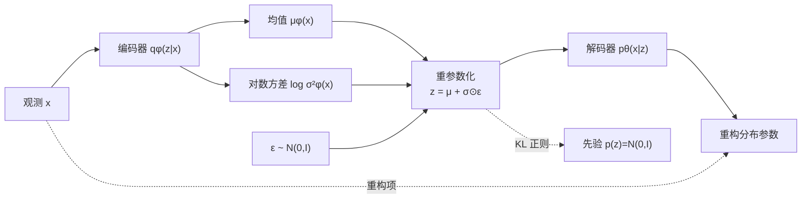

# VAE 及其变体：从公式推导到 PyTorch 实现

这是一个面向学习与科研复现的中文教程仓库。目标不是堆积模型，而是把每个数学对象、假设、损失项与代码实现一一对应起来。

## 内容导航

| 模型 | 潜变量 | 核心变化 | 实现 |
|---|---|---|---|
| VAE | 连续高斯 | 最大化 ELBO | `GaussianVAE` |
| β‑VAE | 连续高斯 | KL 前乘 β，控制信息瓶颈 | `GaussianVAE` + `beta` |
| CVAE | 条件连续高斯 | 编码器、解码器均加入条件 | `ConditionalVAE` |
| IWAE | 连续高斯，多样本 | 重要性加权的更紧下界 | `iwae_loss` |
| VQ‑VAE | 离散码本 | 最近邻量化 + 直通估计 | `VQVAE` |

- [VAE 基础与逐步推导](docs/01-vae-derivation.md)
- [各变体逐步推导](docs/02-variants.md)
- [公式与代码对应表](docs/03-math-to-code.md)
- [论文和参考实现](docs/04-references.md)

> 独立推导公式已预渲染为仓库内的 SVG 矢量图片：打开 GitHub 页面即可直接查看，
> 不依赖浏览器的 MathJax/LaTeX 转换，也不会因页面宽度被压成竖列。

## 总体结构图



## 快速开始

```bash
python -m venv .venv
# Windows: .venv\Scripts\activate
# Linux/macOS: source .venv/bin/activate
pip install -e ".[test]"
pytest -q
python -m vae_lab.train --model vae --epochs 5
python -m vae_lab.train --model beta-vae --beta 4 --epochs 5
python -m vae_lab.train --model cvae --epochs 5
python -m vae_lab.train --model iwae --importance-samples 5 --epochs 5
python -m vae_lab.train --model vq-vae --epochs 5
```

训练脚本使用 MNIST，首次运行会下载数据。单元测试只用随机张量，不需要网络或数据集。

## 如何阅读

1. 先阅读基础推导，明确“证据”“后验”“变分分布”和 ELBO 的关系。
2. 打开 `src/vae_lab/models.py`，按公式编号查找代码注释。
3. 再阅读变体推导，比较每个模型究竟改了概率模型、推断方法还是目标函数。
4. 最后运行测试和短训练，观察重构项、KL 项、码本损失如何变化。

## 重要约定

- 图像像素归一化到 `[0,1]`，基础 VAE/CVAE/IWAE 使用 Bernoulli 似然，因此解码器输出 logits。
- 损失默认对 batch 取平均、对每个样本的像素和潜变量维度求和。
- `logvar` 表示 `log σ²`，所以标准差是 `exp(0.5 * logvar)`。
- VQ‑VAE 在这里重点展示离散表示学习；若要无条件生成，还需另学一个离散先验（如 PixelCNN）来采样码索引。
- 独立公式的可追溯源码保存在 `assets/equations/formulas.json`，网页正文只显示已经排版好的矢量公式。

## 许可

代码采用 MIT License。文档中的论文、公式思想与外部参考实现归其原作者所有；本仓库的代码为统一接口下的独立教学实现。
