# VAE 基础：从最大似然到可训练目标的逐步推导

> 阅读说明：本章独立公式均为预渲染 SVG 矢量图，网页打开即可查看，无需安装插件或转换格式。

## 1. 问题设定

设观测数据为 $x$，不可直接观测的生成因素为 $z$。VAE 假设联合分布可分解为

<p align="center">
  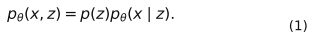
</p>

其中：

- $p(z)$ 是先验，通常取 $\mathcal N(0,I)$；
- $p_\theta(x\mid z)$ 是由解码器参数化的似然；
- $\theta$ 是生成模型参数。

生成过程是先采样 $z\sim p(z)$，再采样 $x\sim p_\theta(x\mid z)$。


训练希望最大化数据的边缘对数似然

<p align="center">
  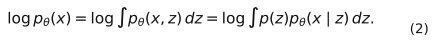
</p>

困难在于：神经网络使积分通常没有解析解。

## 2. 为什么需要近似后验

由 Bayes 公式，

<p align="center">
  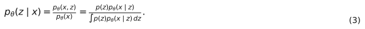
</p>

分母正是难算的边缘似然。于是引入编码器给出的可计算分布

<p align="center">
  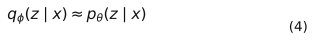
</p>

其中 $\phi$ 是推断模型参数。常用对角高斯：

<p align="center">
  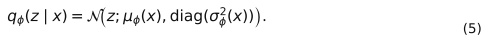
</p>

对角假设意味着给定 $x$ 后各潜变量条件独立：

<p align="center">
  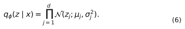
</p>

## 3. ELBO 推导方法一：乘除变分分布并用 Jensen 不等式

从式 (2) 开始，在积分内乘除 $q_\phi(z\mid x)$：

<p align="center">
  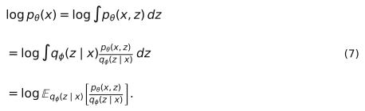
</p>

因为 $\log$ 是凹函数，Jensen 不等式给出

<p align="center">
  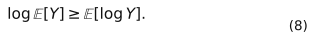
</p>

令 $Y=p_\theta(x,z)/q_\phi(z\mid x)$，得到

<p align="center">
  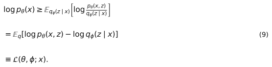
</p>

$\mathcal L$ 称为证据下界，即 ELBO。

利用联合分布分解 $p_\theta(x,z)=p_\theta(x\mid z)p(z)$：

<p align="center">
  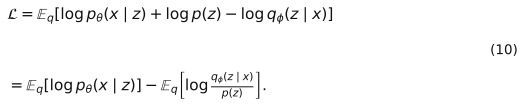
</p>

所以

<p align="center">
  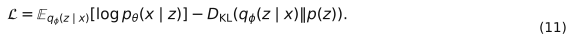
</p>

训练代码通常最小化负 ELBO：

<p align="center">
  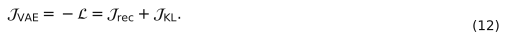
</p>

## 4. ELBO 推导方法二：精确分解与“下界间隙”

从近似后验到真实后验的 KL 散度开始：

<p align="center">
  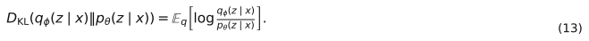
</p>

由 Bayes 公式

<p align="center">
  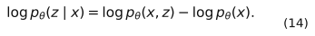
</p>

代入式 (13)：

<p align="center">
  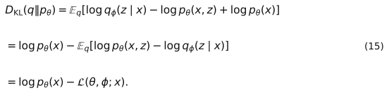
</p>

移项得到精确恒等式

<p align="center">
  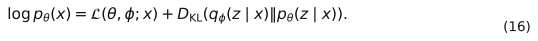
</p>

KL 散度非负，因此 $\mathcal L\le\log p_\theta(x)$。同时，最大化 ELBO 做了两件事：

1. 提高生成模型对数据的边缘似然；
2. 缩小近似后验和真实后验之间的差距。

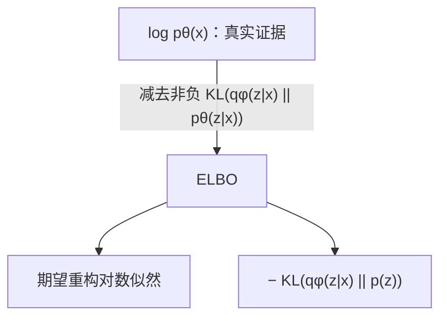

## 5. 对角高斯到标准正态的 KL 闭式解

先看一维情况：

<p align="center">
  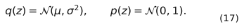
</p>

两者对数密度为

<p align="center">
  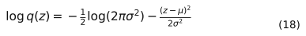
</p>

<p align="center">
  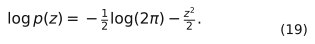
</p>

根据 KL 定义，

<p align="center">
  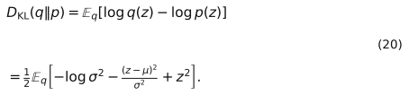
</p>

对 $z\sim\mathcal N(\mu,\sigma^2)$，有

<p align="center">
  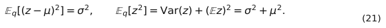
</p>

因此

<p align="center">
  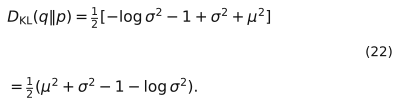
</p>

对 $d$ 维对角高斯，各维相加：

<p align="center">
  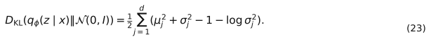
</p>

代码存储 $\ell_j=\log\sigma_j^2$，则 $\sigma_j^2=e^{\ell_j}$：

<p align="center">
  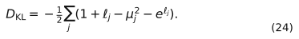
</p>

这正是 `kl_standard_normal(mu, logvar)`。

## 6. 重构项为何是 BCE 或 MSE

### 6.1 Bernoulli 似然

对归一化像素，若假设条件独立 Bernoulli：

<p align="center">
  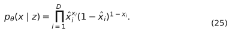
</p>

取负对数：

<p align="center">
  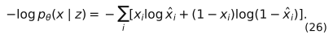
</p>

这就是二元交叉熵 BCE。实际代码让网络输出 logits $a_i$，用
$\hat x_i=\operatorname{sigmoid}(a_i)$，再调用数值稳定的
`binary_cross_entropy_with_logits`。

### 6.2 固定方差高斯似然

若

<p align="center">
  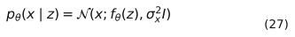
</p>

则

<p align="center">
  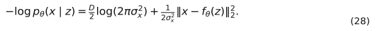
</p>

当 $\sigma_x^2$ 固定时，第一项是常数，最大化似然等价于最小化带比例系数的 MSE。BCE/MSE 不是任意选择，而是对应不同的观测分布假设。

## 7. 为什么必须重参数化

我们需要估计

<p align="center">
  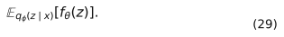
</p>

朴素采样 $z\sim q_\phi$ 时，采样节点依赖 $\phi$，普通反向传播不能直接穿过随机抽样操作。对高斯分布，写成

<p align="center">
  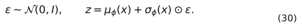
</p>

随机性被移到与参数无关的 $\epsilon$，于是

<p align="center">
  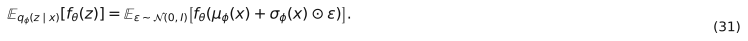
</p>

梯度可写为

<p align="center">
  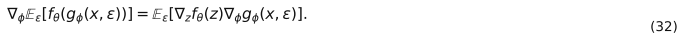
</p>

用一个 Monte Carlo 样本近似：

<p align="center">
  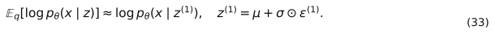
</p>

KL 项已有闭式解，因此不必采样估计。

## 8. 从单样本到数据集目标

对独立同分布数据集 $\{x^{(n)}\}_{n=1}^{N}$：

<p align="center">
  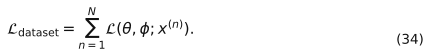
</p>

随机小批量 $B$ 提供无偏缩放估计：

<p align="center">
  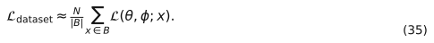
</p>

若只关心寻找最优参数，省略常数 $N$，代码通常最小化 batch 平均负 ELBO。

## 9. 一次训练迭代

```mermaid
sequenceDiagram
    participant X as mini-batch x
    participant E as encoder φ
    participant S as sampler
    participant D as decoder θ
    participant O as optimizer
    X->>E: forward
    E->>S: μ, log σ²
    S->>S: ε~N(0,I); z=μ+σ⊙ε
    S->>D: z
    D-->>X: reconstruction logits
    X->>O: reconstruction NLL + KL
    O->>E: backprop/update φ
    O->>D: backprop/update θ
```

完整目标为

<p align="center">
  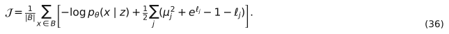
</p>

## 10. 常见误区

1. **把 KL 符号写反。** 训练最小化的是正的
   $D_{\mathrm{KL}}(q\Vert p)$，不是其负数。
2. **混淆方差、标准差和 logvar。** 若输出是
   $\log\sigma^2$，标准差必须用 `exp(0.5 * logvar)`。
3. **重构损失 reduction 不一致。** 像素求平均会让 KL 的相对权重随分辨率改变。
4. **对 logits 先 sigmoid 又使用 `BCEWithLogitsLoss`。** 这会重复 sigmoid。
5. **把 VAE 的重构输出直接称为生成。** 真正无条件生成应从先验采样 $z$，而不是编码一张已有图像。
