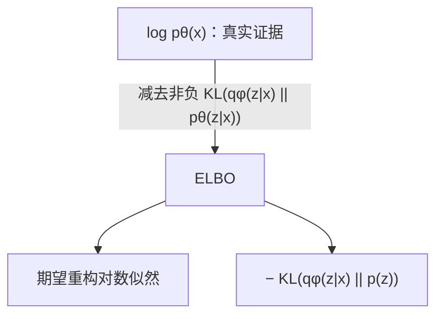

# VAE 基础：从最大似然到可训练目标的逐步推导

> 阅读说明：本章独立公式均使用 GitHub 原生 LaTeX `math` 块，网页打开即可查看，
> 同时可以直接复制和修改公式源码。

## 1. 问题设定

设观测数据为 $x$，不可直接观测的生成因素为 $z$。VAE 假设联合分布可分解为

```math
p_\theta(x,z)=p(z)p_\theta(x\mid z).
\tag{1}
```

其中：

- $p(z)$ 是先验，通常取 $\mathcal N(0,I)$；
- $p_\theta(x\mid z)$ 是由解码器参数化的似然；
- $\theta$ 是生成模型参数。

生成过程是先采样 $z\sim p(z)$，再采样 $x\sim p_\theta(x\mid z)$。


训练希望最大化数据的边缘对数似然

```math
\log p_\theta(x)=\log\int p_\theta(x,z)\,dz
=\log\int p(z)p_\theta(x\mid z)\,dz.
\tag{2}
```

困难在于：神经网络使积分通常没有解析解。

## 2. 为什么需要近似后验

由 Bayes 公式，

```math
p_\theta(z\mid x)
=\frac{p_\theta(x,z)}{p_\theta(x)}
=\frac{p(z)p_\theta(x\mid z)}
{\int p(z)p_\theta(x\mid z)\,dz}.
\tag{3}
```

分母正是难算的边缘似然。于是引入编码器给出的可计算分布

```math
q_\phi(z\mid x)\approx p_\theta(z\mid x),
\tag{4}
```

其中 $\phi$ 是推断模型参数。常用对角高斯：

```math
q_\phi(z\mid x)
=\mathcal N\!\left(
z;\mu_\phi(x),
\operatorname{diag}(\sigma_\phi^2(x))
\right).
\tag{5}
```

对角假设意味着给定 $x$ 后各潜变量条件独立：

```math
q_\phi(z\mid x)=\prod_{j=1}^{d}
\mathcal N(z_j;\mu_j,\sigma_j^2).
\tag{6}
```

## 3. ELBO 推导方法一：乘除变分分布并用 Jensen 不等式

从式 (2) 开始，在积分内乘除 $q_\phi(z\mid x)$：

```math
\begin{aligned}
\log p_\theta(x)
&=\log\int p_\theta(x,z)\,dz\\
&=\log\int q_\phi(z\mid x)
\frac{p_\theta(x,z)}{q_\phi(z\mid x)}\,dz\\
&=\log\mathbb E_{q_\phi(z\mid x)}
\left[\frac{p_\theta(x,z)}{q_\phi(z\mid x)}\right].
\end{aligned}
\tag{7}
```

因为 $\log$ 是凹函数，Jensen 不等式给出

```math
\log\mathbb E[Y]\ge \mathbb E[\log Y].
\tag{8}
```

令 $Y=p_\theta(x,z)/q_\phi(z\mid x)$，得到

```math
\begin{aligned}
\log p_\theta(x)
&\ge
\mathbb E_{q_\phi(z\mid x)}
\left[
\log\frac{p_\theta(x,z)}{q_\phi(z\mid x)}
\right]\\
&=
\mathbb E_q[
\log p_\theta(x,z)-\log q_\phi(z\mid x)
]\\
&\equiv \mathcal L(\theta,\phi;x).
\end{aligned}
\tag{9}
```

$\mathcal L$ 称为证据下界，即 ELBO。

利用联合分布分解 $p_\theta(x,z)=p_\theta(x\mid z)p(z)$：

```math
\begin{aligned}
\mathcal L
&=\mathbb E_q[
\log p_\theta(x\mid z)+\log p(z)-\log q_\phi(z\mid x)
]\\
&=\underbrace{\mathbb E_q[\log p_\theta(x\mid z)]}_{\text{期望重构对数似然}}
-\underbrace{
\mathbb E_q\left[
\log\frac{q_\phi(z\mid x)}{p(z)}
\right]}_{D_{\mathrm{KL}}(q_\phi(z\mid x)\Vert p(z))}.
\end{aligned}
\tag{10}
```

所以

```math
\boxed{
\mathcal L
=\mathbb E_{q_\phi(z\mid x)}[\log p_\theta(x\mid z)]
-D_{\mathrm{KL}}(q_\phi(z\mid x)\Vert p(z))
}.
\tag{11}
```

训练代码通常最小化负 ELBO：

```math
\boxed{
\mathcal J_{\mathrm{VAE}}
=-\mathcal L
=\mathcal J_{\mathrm{rec}}+\mathcal J_{\mathrm{KL}}
}.
\tag{12}
```

## 4. ELBO 推导方法二：精确分解与“下界间隙”

从近似后验到真实后验的 KL 散度开始：

```math
D_{\mathrm{KL}}(q_\phi(z\mid x)\Vert p_\theta(z\mid x))
=\mathbb E_q\left[
\log\frac{q_\phi(z\mid x)}{p_\theta(z\mid x)}
\right].
\tag{13}
```

由 Bayes 公式

```math
\log p_\theta(z\mid x)
=\log p_\theta(x,z)-\log p_\theta(x).
\tag{14}
```

代入式 (13)：

```math
\begin{aligned}
D_{\mathrm{KL}}(q\Vert p_\theta)
&=\mathbb E_q[
\log q_\phi(z\mid x)-\log p_\theta(x,z)+\log p_\theta(x)
]\\
&=\log p_\theta(x)
-\mathbb E_q[
\log p_\theta(x,z)-\log q_\phi(z\mid x)
]\\
&=\log p_\theta(x)-\mathcal L(\theta,\phi;x).
\end{aligned}
\tag{15}
```

移项得到精确恒等式

```math
\boxed{
\log p_\theta(x)
=\mathcal L(\theta,\phi;x)
+D_{\mathrm{KL}}(q_\phi(z\mid x)\Vert p_\theta(z\mid x))
}.
\tag{16}
```

KL 散度非负，因此 $\mathcal L\le\log p_\theta(x)$。同时，最大化 ELBO 做了两件事：

1. 提高生成模型对数据的边缘似然；
2. 缩小近似后验和真实后验之间的差距。



## 5. 对角高斯到标准正态的 KL 闭式解

先看一维情况：

```math
q(z)=\mathcal N(\mu,\sigma^2),\qquad p(z)=\mathcal N(0,1).
\tag{17}
```

两者对数密度为

```math
\log q(z)=-\frac12\log(2\pi\sigma^2)
-\frac{(z-\mu)^2}{2\sigma^2},
\tag{18}
```

```math
\log p(z)=-\frac12\log(2\pi)-\frac{z^2}{2}.
\tag{19}
```

根据 KL 定义，

```math
\begin{aligned}
D_{\mathrm{KL}}(q\Vert p)
&=\mathbb E_q[\log q(z)-\log p(z)]\\
&=\frac12\mathbb E_q\left[
-\log\sigma^2-\frac{(z-\mu)^2}{\sigma^2}+z^2
\right].
\end{aligned}
\tag{20}
```

对 $z\sim\mathcal N(\mu,\sigma^2)$，有

```math
\mathbb E_q[(z-\mu)^2]=\sigma^2,
\qquad
\mathbb E_q[z^2]=\operatorname{Var}(z)+(\mathbb E z)^2
=\sigma^2+\mu^2.
\tag{21}
```

因此

```math
\begin{aligned}
D_{\mathrm{KL}}(q\Vert p)
&=\frac12[
-\log\sigma^2-1+\sigma^2+\mu^2
]\\
&=\frac12(\mu^2+\sigma^2-1-\log\sigma^2).
\end{aligned}
\tag{22}
```

对 $d$ 维对角高斯，各维相加：

```math
\boxed{
D_{\mathrm{KL}}(q_\phi(z\mid x)\Vert\mathcal N(0,I))
=\frac12\sum_{j=1}^{d}
(\mu_j^2+\sigma_j^2-1-\log\sigma_j^2)
}.
\tag{23}
```

代码存储 $\ell_j=\log\sigma_j^2$，则 $\sigma_j^2=e^{\ell_j}$：

```math
\boxed{
D_{\mathrm{KL}}
=-\frac12\sum_j(1+\ell_j-\mu_j^2-e^{\ell_j})
}.
\tag{24}
```

这正是 `kl_standard_normal(mu, logvar)`。

## 6. 重构项为何是 BCE 或 MSE

### 6.1 Bernoulli 似然

对归一化像素，若假设条件独立 Bernoulli：

```math
p_\theta(x\mid z)=\prod_{i=1}^{D}
\hat x_i^{x_i}(1-\hat x_i)^{1-x_i}.
\tag{25}
```

取负对数：

```math
-\log p_\theta(x\mid z)
=-\sum_i[x_i\log\hat x_i+(1-x_i)\log(1-\hat x_i)].
\tag{26}
```

这就是二元交叉熵 BCE。实际代码让网络输出 logits $a_i$，用
$\hat x_i=\operatorname{sigmoid}(a_i)$，再调用数值稳定的
`binary_cross_entropy_with_logits`。

### 6.2 固定方差高斯似然

若

```math
p_\theta(x\mid z)=\mathcal N(x;f_\theta(z),\sigma_x^2 I),
\tag{27}
```

则

```math
-\log p_\theta(x\mid z)
=\frac{D}{2}\log(2\pi\sigma_x^2)
+\frac{1}{2\sigma_x^2}\|x-f_\theta(z)\|_2^2.
\tag{28}
```

当 $\sigma_x^2$ 固定时，第一项是常数，最大化似然等价于最小化带比例系数的 MSE。BCE/MSE 不是任意选择，而是对应不同的观测分布假设。

## 7. 为什么必须重参数化

我们需要估计

```math
\mathbb E_{q_\phi(z\mid x)}[f_\theta(z)].
\tag{29}
```

朴素采样 $z\sim q_\phi$ 时，采样节点依赖 $\phi$，普通反向传播不能直接穿过随机抽样操作。对高斯分布，写成

```math
\epsilon\sim\mathcal N(0,I),
\qquad
z=\mu_\phi(x)+\sigma_\phi(x)\odot\epsilon.
\tag{30}
```

随机性被移到与参数无关的 $\epsilon$，于是

```math
\mathbb E_{q_\phi(z\mid x)}[f_\theta(z)]
=\mathbb E_{\epsilon\sim\mathcal N(0,I)}
\left[
f_\theta(\mu_\phi(x)+\sigma_\phi(x)\odot\epsilon)
\right].
\tag{31}
```

梯度可写为

```math
\nabla_\phi\mathbb E_\epsilon[f_\theta(g_\phi(x,\epsilon))]
=\mathbb E_\epsilon[
\nabla_z f_\theta(z)\nabla_\phi g_\phi(x,\epsilon)
].
\tag{32}
```

用一个 Monte Carlo 样本近似：

```math
\mathbb E_q[\log p_\theta(x\mid z)]
\approx \log p_\theta(x\mid z^{(1)}),
\quad z^{(1)}=\mu+\sigma\odot\epsilon^{(1)}.
\tag{33}
```

KL 项已有闭式解，因此不必采样估计。

## 8. 从单样本到数据集目标

对独立同分布数据集 $\{x^{(n)}\}_{n=1}^{N}$：

```math
\mathcal L_{\mathrm{dataset}}
=\sum_{n=1}^{N}\mathcal L(\theta,\phi;x^{(n)}).
\tag{34}
```

随机小批量 $B$ 提供无偏缩放估计：

```math
\mathcal L_{\mathrm{dataset}}
\approx\frac{N}{|B|}\sum_{x\in B}\mathcal L(\theta,\phi;x).
\tag{35}
```

若只关心寻找最优参数，省略常数 $N$，代码通常最小化 batch 平均负 ELBO。

## 9. 一次训练迭代

```mermaid
sequenceDiagram
    participant X as mini-batch x
    participant E as encoder φ
    participant S as sampler
    participant D as decoder θ
    participant O as optimizer
    X->>E: forward
    E->>S: μ, log σ²
    S->>S: ε~N(0,I); z=μ+σ⊙ε
    S->>D: z
    D-->>X: reconstruction logits
    X->>O: reconstruction NLL + KL
    O->>E: backprop/update φ
    O->>D: backprop/update θ
```

完整目标为

```math
\mathcal J
=\frac1{|B|}\sum_{x\in B}
\left[
-\log p_\theta(x\mid z)
+\frac12\sum_j(\mu_j^2+e^{\ell_j}-1-\ell_j)
\right].
\tag{36}
```

## 10. 常见误区

1. **把 KL 符号写反。** 训练最小化的是正的
   $D_{\mathrm{KL}}(q\Vert p)$，不是其负数。
2. **混淆方差、标准差和 logvar。** 若输出是
   $\log\sigma^2$，标准差必须用 `exp(0.5 * logvar)`。
3. **重构损失 reduction 不一致。** 像素求平均会让 KL 的相对权重随分辨率改变。
4. **对 logits 先 sigmoid 又使用 `BCEWithLogitsLoss`。** 这会重复 sigmoid。
5. **把 VAE 的重构输出直接称为生成。** 真正无条件生成应从先验采样 $z$，而不是编码一张已有图像。
