# VAE 变体逐步推导

> 阅读说明：本章独立公式均为预渲染 SVG 矢量图，网页打开即可查看，无需安装插件或转换格式。

本章区分三类改动：

- **改变目标权重**：β‑VAE；
- **改变条件信息或估计方法**：CVAE、IWAE；
- **改变潜变量类型与优化方法**：VQ‑VAE。

## 1. β‑VAE：受约束信息瓶颈

标准 VAE 目标为

  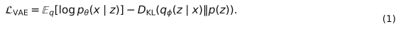

β‑VAE 修改为

  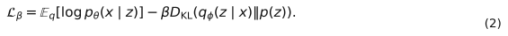

它可从约束优化得到。希望重构尽可能好，同时限制每个样本的平均编码容量：

  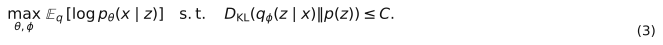

构造 Lagrangian：

  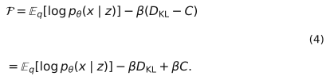

$C$ 固定时 $\beta C$ 不影响参数最优点，于是得到式 (2)。

- $\beta=1$：标准 VAE；
- $\beta>1$：更强压缩，常促进因子化表示，但可能牺牲重构；
- $0<\beta<1$：更重视重构，但潜空间可能偏离先验。

注意：无监督解耦一般不具可识别性保证；β 增大并不自动保证语义解耦。

## 2. CVAE：在给定条件下建模

令 $c$ 为类别、天气、历史轨迹或其他条件。目标从 $p(x)$ 变为

  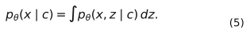

常用分解为

  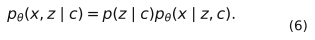

引入近似后验 $q_\phi(z\mid x,c)$。乘除它：

  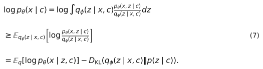

若取与条件无关的先验 $p(z\mid c)=p(z)=\mathcal N(0,I)$：

  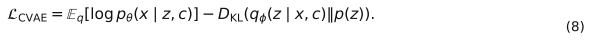

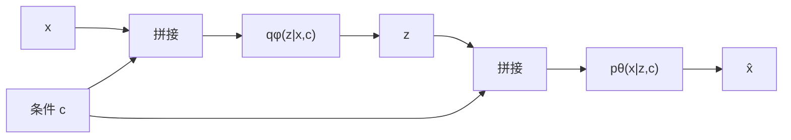

训练时编码器看 $x,c$，生成时只给定 $c$，再采样
$z\sim p(z)$。若使用可学习条件先验 $p_\psi(z\mid c)$，则生成时应从该先验采样，KL 也必须改成两个条件高斯之间的 KL。

## 3. IWAE：用多个重要性样本收紧下界

定义重要性权重

  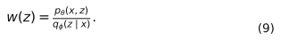

因为

  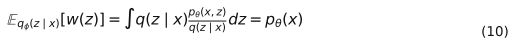

取 $K$ 个独立样本 $z_1,\ldots,z_K\sim q_\phi(z\mid x)$，有

  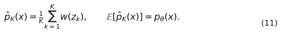

对 $\log$ 使用 Jensen 不等式：

  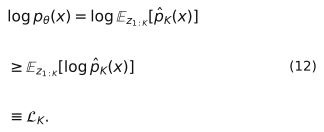

因此

  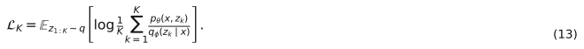

当 $K=1$：

  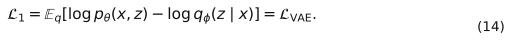

实现时令

  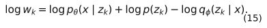

为避免指数溢出，使用

  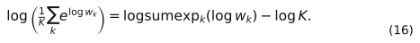

在常见条件下 $\mathcal L_K$ 随 $K$ 增大而变紧，且极限趋近
$\log p_\theta(x)$。但更大的 $K$ 增加显存和计算量，并可能降低推断网络梯度的信噪比。

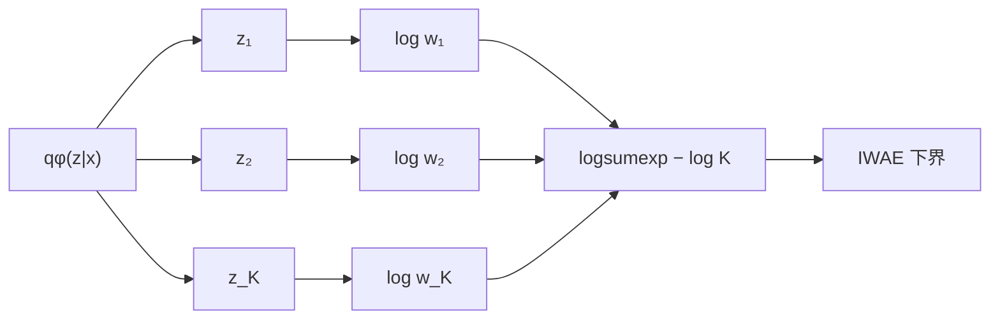

## 4. VQ‑VAE：从连续编码到离散码本

VQ‑VAE 编码器先输出连续向量

  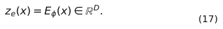

维护包含 $K$ 个向量的码本

  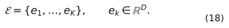

通过最近邻选择离散索引：

  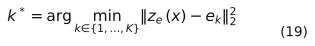

  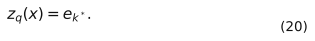

距离可高效展开：

  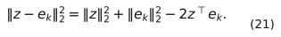

总损失为

  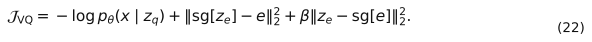

$\operatorname{sg}$ 是 stop-gradient：

  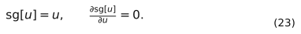

逐项看梯度：

1. 码本损失中 `sg[z_e]` 阻断编码器梯度，只把选中的码向编码输出拉近；
2. 承诺损失中 `sg[e]` 阻断码本梯度，只要求编码器承诺靠近某个码；
3. 最近邻 `argmin` 不可导，因此重构梯度采用直通估计。

直通估计写成

  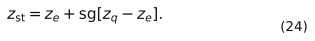

前向数值：

  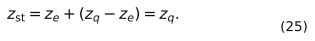

反向导数：

  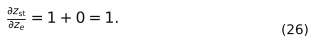

因此解码器前向看到量化向量，而重构梯度像恒等映射一样传给编码器。

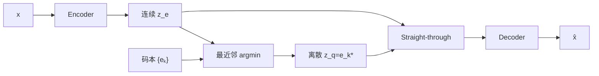

若离散先验取均匀分布且编码器索引是确定性的，原始 VQ‑VAE 中对应 KL 项为常数 $\log K$，训练时可省略。要从零生成新样本，仍需训练 $p(k)$ 或 $p(k_{1:T})$；仅从均匀码本随机采样通常不能得到有结构的样本。

## 5. 横向比较

| 问题 | VAE | β‑VAE | CVAE | IWAE | VQ‑VAE |
|---|---|---|---|---|---|
| 潜空间 | 连续 | 连续 | 连续 | 连续 | 离散 |
| 推断样本数 | 1 | 1 | 1 | $K$ | 最近邻 |
| 目标变化 | ELBO | 加权 KL | 条件 ELBO | 更紧下界 | 重构+码本+承诺 |
| 可控生成 | 无 | 无 | 有条件 | 无 | 需离散先验 |
| 主要风险 | 后验坍塌 | 重构变差 | 条件被忽略 | 计算开销 | 码本坍塌 |
