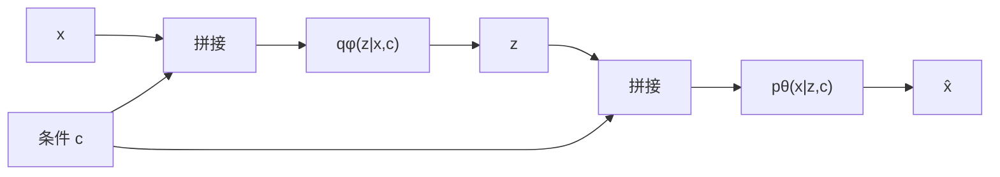
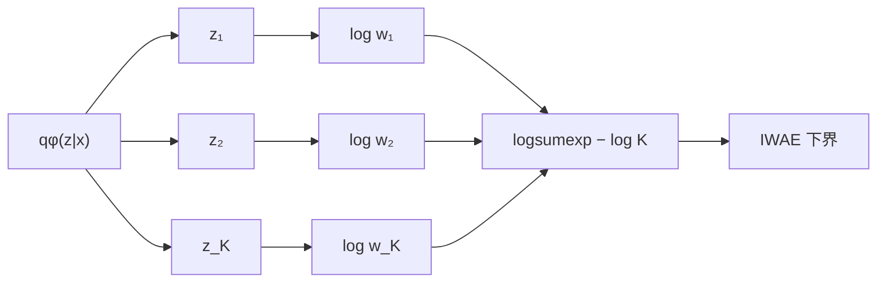
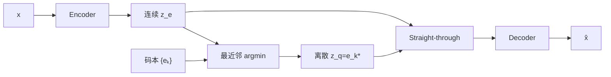

# VAE 变体逐步推导

本章区分三类改动：

- **改变目标权重**：β‑VAE；
- **改变条件信息或估计方法**：CVAE、IWAE；
- **改变潜变量类型与优化方法**：VQ‑VAE。

## 1. β‑VAE：受约束信息瓶颈

标准 VAE 目标为

$$
\mathcal L_{\mathrm{VAE}}
=\mathbb E_q[\log p_\theta(x\mid z)]
-D_{\mathrm{KL}}(q_\phi(z\mid x)\Vert p(z)).
\tag{1}
$$

β‑VAE 修改为

$$
\boxed{
\mathcal L_{\beta}
=\mathbb E_q[\log p_\theta(x\mid z)]
-\beta D_{\mathrm{KL}}(q_\phi(z\mid x)\Vert p(z))
}.
\tag{2}
$$

它可从约束优化得到。希望重构尽可能好，同时限制每个样本的平均编码容量：

$$
\max_{\theta,\phi}\ 
\mathbb E_q[\log p_\theta(x\mid z)]
\quad
\text{s.t.}\quad
D_{\mathrm{KL}}(q_\phi(z\mid x)\Vert p(z))\le C.
\tag{3}
$$

构造 Lagrangian：

$$
\begin{aligned}
\mathcal F
&=\mathbb E_q[\log p_\theta(x\mid z)]
-\beta(D_{\mathrm{KL}}-C)\\
&=\mathbb E_q[\log p_\theta(x\mid z)]
-\beta D_{\mathrm{KL}}+\beta C.
\end{aligned}
\tag{4}
$$

$C$ 固定时 $\beta C$ 不影响参数最优点，于是得到式 (2)。

- $\beta=1$：标准 VAE；
- $\beta>1$：更强压缩，常促进因子化表示，但可能牺牲重构；
- $0<\beta<1$：更重视重构，但潜空间可能偏离先验。

注意：无监督解耦一般不具可识别性保证；β 增大并不自动保证语义解耦。

## 2. CVAE：在给定条件下建模

令 $c$ 为类别、天气、历史轨迹或其他条件。目标从 $p(x)$ 变为

$$
p_\theta(x\mid c)=\int p_\theta(x,z\mid c)\,dz.
\tag{5}
$$

常用分解为

$$
p_\theta(x,z\mid c)=p(z\mid c)p_\theta(x\mid z,c).
\tag{6}
$$

引入近似后验 $q_\phi(z\mid x,c)$。乘除它：

$$
\begin{aligned}
\log p_\theta(x\mid c)
&=\log\int q_\phi(z\mid x,c)
\frac{p_\theta(x,z\mid c)}{q_\phi(z\mid x,c)}dz\\
&\ge
\mathbb E_{q_\phi(z\mid x,c)}
\left[
\log\frac{p_\theta(x,z\mid c)}{q_\phi(z\mid x,c)}
\right]\\
&=
\mathbb E_q[\log p_\theta(x\mid z,c)]
-D_{\mathrm{KL}}(q_\phi(z\mid x,c)\Vert p(z\mid c)).
\end{aligned}
\tag{7}
$$

若取与条件无关的先验 $p(z\mid c)=p(z)=\mathcal N(0,I)$：

$$
\boxed{
\mathcal L_{\mathrm{CVAE}}
=\mathbb E_q[\log p_\theta(x\mid z,c)]
-D_{\mathrm{KL}}(q_\phi(z\mid x,c)\Vert p(z))
}.
\tag{8}
$$

训练时编码器看 $x,c$，生成时只给定 $c$，再采样
$z\sim p(z)$。若使用可学习条件先验 $p_\psi(z\mid c)$，则生成时应从该先验采样，KL 也必须改成两个条件高斯之间的 KL。

## 3. IWAE：用多个重要性样本收紧下界

定义重要性权重

$$
w(z)=\frac{p_\theta(x,z)}{q_\phi(z\mid x)}.
\tag{9}
$$

因为

$$
\mathbb E_{q_\phi(z\mid x)}[w(z)]
=\int q(z\mid x)\frac{p_\theta(x,z)}{q(z\mid x)}dz
=p_\theta(x),
\tag{10}
$$

取 $K$ 个独立样本 $z_1,\ldots,z_K\sim q_\phi(z\mid x)$，有

$$
\hat p_K(x)=\frac1K\sum_{k=1}^{K}w(z_k),
\qquad
\mathbb E[\hat p_K(x)]=p_\theta(x).
\tag{11}
$$

对 $\log$ 使用 Jensen 不等式：

$$
\begin{aligned}
\log p_\theta(x)
&=\log\mathbb E_{z_{1:K}}[\hat p_K(x)]\\
&\ge\mathbb E_{z_{1:K}}[\log\hat p_K(x)]\\
&\equiv\mathcal L_K.
\end{aligned}
\tag{12}
$$

因此

$$
\boxed{
\mathcal L_K
=\mathbb E_{z_{1:K}\sim q}
\left[
\log\frac1K\sum_{k=1}^{K}
\frac{p_\theta(x,z_k)}{q_\phi(z_k\mid x)}
\right]
}.
\tag{13}
$$

当 $K=1$：

$$
\mathcal L_1
=\mathbb E_q[\log p_\theta(x,z)-\log q_\phi(z\mid x)]
=\mathcal L_{\mathrm{VAE}}.
\tag{14}
$$

实现时令

$$
\log w_k
=\log p_\theta(x\mid z_k)+\log p(z_k)-\log q_\phi(z_k\mid x).
\tag{15}
$$

为避免指数溢出，使用

$$
\log\left(\frac1K\sum_k e^{\log w_k}\right)
=\operatorname{logsumexp}_k(\log w_k)-\log K.
\tag{16}
$$

在常见条件下 $\mathcal L_K$ 随 $K$ 增大而变紧，且极限趋近
$\log p_\theta(x)$。但更大的 $K$ 增加显存和计算量，并可能降低推断网络梯度的信噪比。

## 4. VQ‑VAE：从连续编码到离散码本

VQ‑VAE 编码器先输出连续向量

$$
z_e(x)=E_\phi(x)\in\mathbb R^D.
\tag{17}
$$

维护包含 $K$ 个向量的码本

$$
\mathcal E=\{e_1,\ldots,e_K\},\qquad e_k\in\mathbb R^D.
\tag{18}
$$

通过最近邻选择离散索引：

$$
k^\*=\arg\min_{k\in\{1,\ldots,K\}}
\|z_e(x)-e_k\|_2^2,
\tag{19}
$$

$$
z_q(x)=e_{k^\*}.
\tag{20}
$$

距离可高效展开：

$$
\|z-e_k\|_2^2
=\|z\|_2^2+\|e_k\|_2^2-2z^\top e_k.
\tag{21}
$$

总损失为

$$
\boxed{
\mathcal J_{\mathrm{VQ}}
=\underbrace{-\log p_\theta(x\mid z_q)}_{\text{重构}}
+\underbrace{\|\operatorname{sg}[z_e]-e\|_2^2}_{\text{码本损失}}
+\beta\underbrace{\|z_e-\operatorname{sg}[e]\|_2^2}_{\text{承诺损失}}
}.
\tag{22}
$$

$\operatorname{sg}$ 是 stop-gradient：

$$
\operatorname{sg}[u]=u,\qquad
\frac{\partial\operatorname{sg}[u]}{\partial u}=0.
\tag{23}
$$

逐项看梯度：

1. 码本损失中 `sg[z_e]` 阻断编码器梯度，只把选中的码向编码输出拉近；
2. 承诺损失中 `sg[e]` 阻断码本梯度，只要求编码器承诺靠近某个码；
3. 最近邻 `argmin` 不可导，因此重构梯度采用直通估计。

直通估计写成

$$
z_{\mathrm{st}}
=z_e+\operatorname{sg}[z_q-z_e].
\tag{24}
$$

前向数值：

$$
z_{\mathrm{st}}=z_e+(z_q-z_e)=z_q.
\tag{25}
$$

反向导数：

$$
\frac{\partial z_{\mathrm{st}}}{\partial z_e}
=1+0=1.
\tag{26}
$$

因此解码器前向看到量化向量，而重构梯度像恒等映射一样传给编码器。

若离散先验取均匀分布且编码器索引是确定性的，原始 VQ‑VAE 中对应 KL 项为常数 $\log K$，训练时可省略。要从零生成新样本，仍需训练 $p(k)$ 或 $p(k_{1:T})$；仅从均匀码本随机采样通常不能得到有结构的样本。

## 5. 横向比较

| 问题 | VAE | β‑VAE | CVAE | IWAE | VQ‑VAE |
|---|---|---|---|---|---|
| 潜空间 | 连续 | 连续 | 连续 | 连续 | 离散 |
| 推断样本数 | 1 | 1 | 1 | $K$ | 最近邻 |
| 目标变化 | ELBO | 加权 KL | 条件 ELBO | 更紧下界 | 重构+码本+承诺 |
| 可控生成 | 无 | 无 | 有条件 | 无 | 需离散先验 |
| 主要风险 | 后验坍塌 | 重构变差 | 条件被忽略 | 计算开销 | 码本坍塌 |

